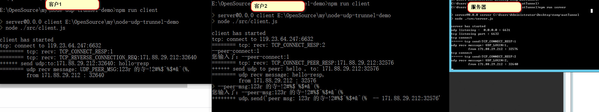

# node-udp-trunnel-demo
  node.js 的 udp 穿透 demo, 需要一个公网IP

### Install
```
$ npm install 
```


### Usage
* server
```
在有公网IP的电脑上运行
$ npm run server
```

* client
```
修改 ./src/common/config.js 的 serverIp 为你的公网ip

$npm run client

连接peer(需要指定ID)
$--peer-connect:1

发送消息
$--peer-msg:xxxx
```

### 运行截图


